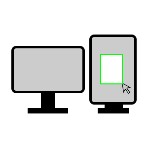
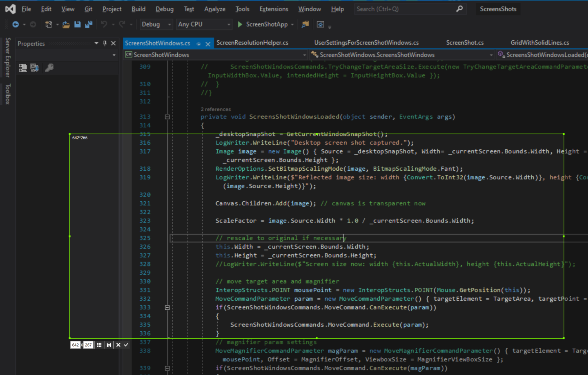
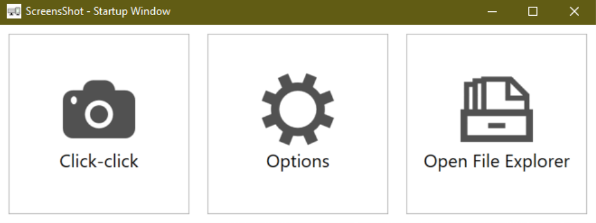
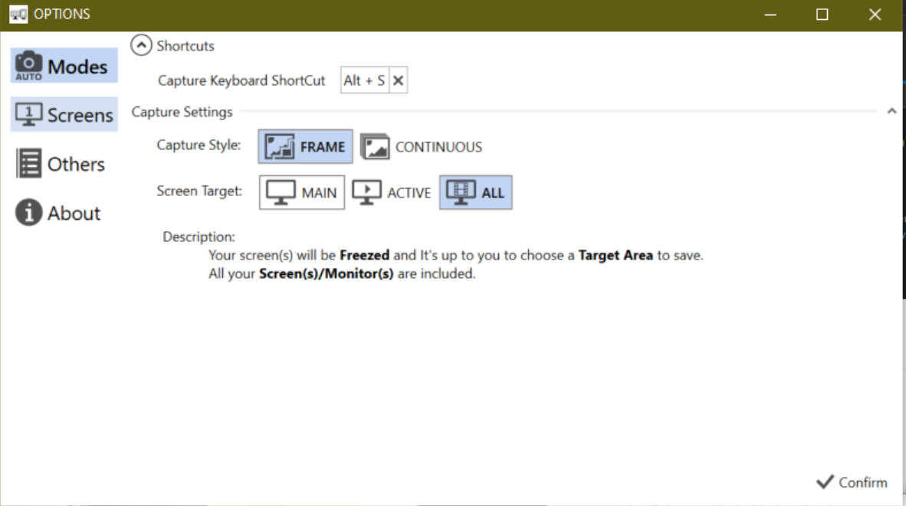
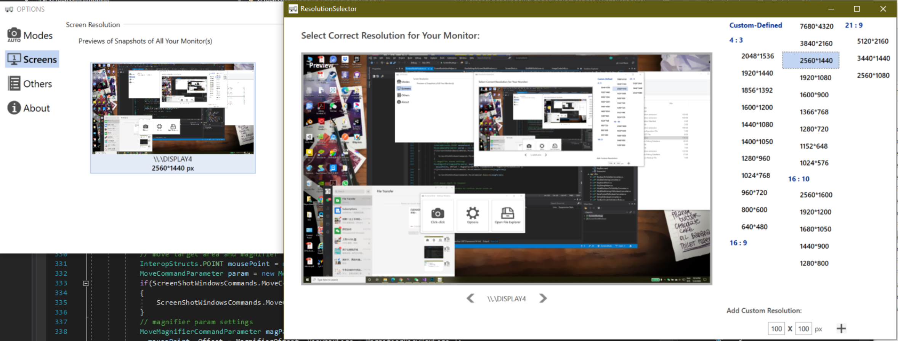
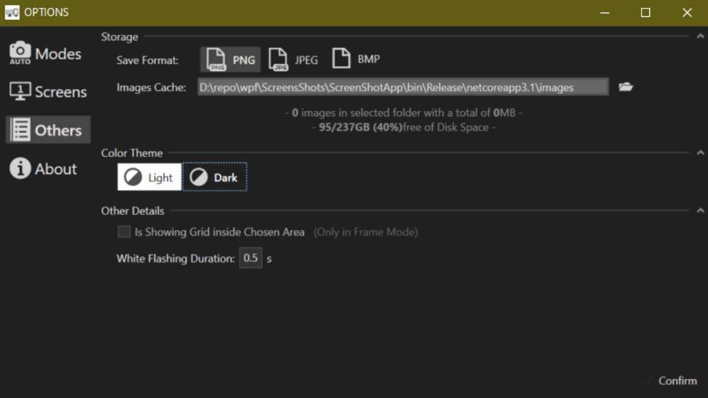

  # ScreensShots

###This is a free & open-source tool for taking snapshots of multiple screens/monitors on Windows PC. 

 

 Frame mode that allows you to choose an area on any of your monitors

[中文](README_CN.md)

 **It requires a [.NET Core 3.1](https://dotnet.microsoft.com/download/dotnet-core/3.1) (or above) environment  ** 

Features:
 - One tool for multiple monitors with different dpi / system UI scales
 - Different modes: Instant screenshot(s) of the whole monitor(s) or of a specific area
 - You can definitely use it for one monitor as well

How to use it:
 - Install it.
 - Open options window and check shortcut and if previews of all your monitors are shown correctly.
 - Click-click.

Examples:

 

 Start-up Page 

 

 Options Page 

 

 Resolution Detection & Set 

 

 Dark Theme 

Known Issues:
 - Cannot identify the second monitor correctly if change primary monitor to another one while using "second screen only".
 - Incorrect position of floating buttons after selecting the desired area.

Trivials:
 - It's a WPF project and dooesn't require any special NuGet package. If you want to compile it, just make a copy and use VS or enter `dotnet run` in the command line.
 - In essence, this app tries to "guess" what is the correct resolution for each monitor and it will remember your settings if you change the defaults. At its core, it uses gdi to capture screen by frame.
 - WPF is not per-monitor-dpi-aware for any Windows version. Therefore, you may experience blurriness on certain screen(s) when the ScreenShots freezes your screen. Don't worry, ScreenShots will make sure those final snapshots are in lostless quality (if you choose png/bmp).
 - Welcome to report bugs / criticise me (via Issue or my personal mail xinyu@fishesplace.com)
 - I named this app ScreensShots because I like palindrome so much and this sounds like a quasi word-by-word palindrome: "ScreenShots Shots Screens".
 
Huge Thanks to:
 - [Nicke Manarin and his ScreenToGif](https://github.com/NickeManarin/ScreenToGif) I used some of his fantastic custom controls and I won't pretend they are mine.
 - [Modern UI Icons](http://modernuiicons.com/) for all lovely icons in this app.
 - [Handy Control](https://github.com/HandyOrg/HandyControl) for their practical example of using Gdi and device context for screenshot
 