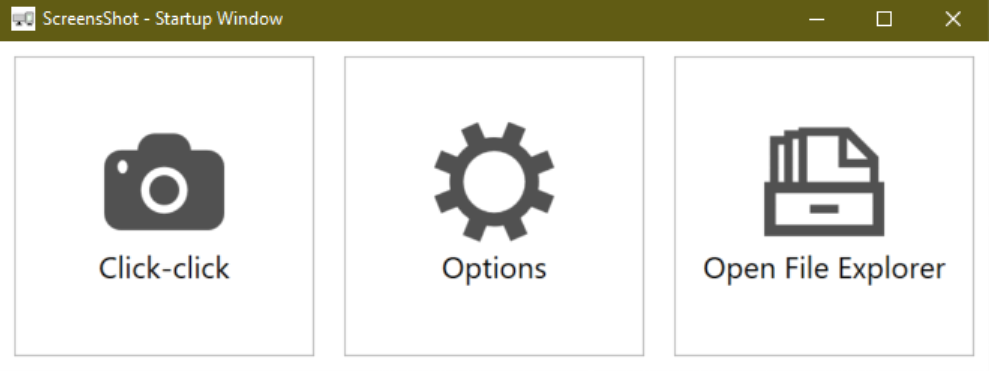
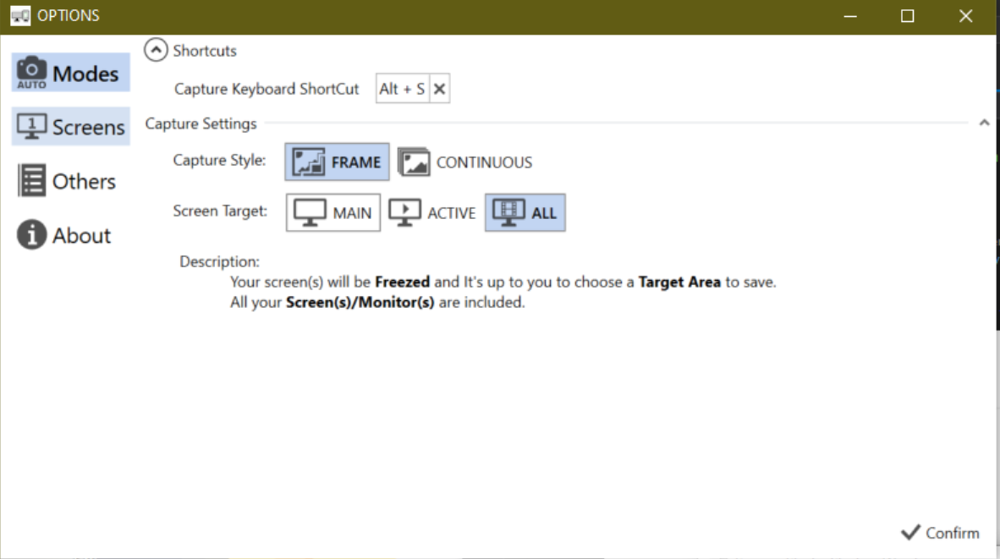

	

<h1 align="center"> 截多屏 </h1>

这是款免费且开源的适合截取多屏幕的截屏软件，仅适用于Windows系统。

	

 单帧模式，可以选择任意大小的区域截屏

<h2 align="center">需要 <a href="https://dotnet.microsoft.com/download/dotnet-core/3.1">.NET Core 3.1</a> 或以上运行环境</h2>

<h3>特性：</h3>

 - 特别适用于一次在多个屏幕（尤其是不同DPI，放大倍数）的截图，保证它们的任意区域都能被合理地截取
 - 多种模式：单帧模式或连续整个屏幕截取
 - 单屏幕同样适用

<h3>如何使用： </h3>

 - 安装
 - 打开选项菜单查看是否所有屏幕的分辨率都以被正确识别
 - 点击截屏

<h3>使用展示:</h3>

</img>

</img>

</img>

</img>

<h3>已知问题：</h3>

 - Cannot identify the second monitor correctly if change primary monitor to another one while using "second screen only".
 - Incorrect position of floating buttons after selecting the desired area.

<h3>其他:</h3>

 - 这是个WPF制作的软件，轻巧方便，无需其他NuGet包。 如想要本地编译，先拷贝再用VS或者用dotnet run。
 - 本软件主要会根据win32提供的dpi推测每个屏幕的分辨率，并记住后续的调整选项，以此保证能够显示多屏完整的内容。核心部分采用的是GDI提供的Bitmap生成接口。
 - WPF本身不能根据显示器DPI调整在不同窗口的显示（至少不是在所有版本内）。 因此，在多屏不同DPI的情况下选择区域时会有模糊的现象。 不用担心，我会保证选择区域是正确清晰的。
 - 欢迎提交 bugs / 批评我 (提交 Issue 或者给我发邮箱 xinyu@fishesplace.com)

<h3>特别感谢:</h3>

 - [Nicke Manarin and his ScreenToGif](https://github.com/NickeManarin/ScreenToGif) I used some of his fantastic custom controls and I won't pretend they are mine.
 - [Modern UI Icons](http://modernuiicons.com/) for all lovely icons in this app.
 - [Handy Control](https://github.com/HandyOrg/HandyControl) for their practical example of using Gdi and device context for screenshot